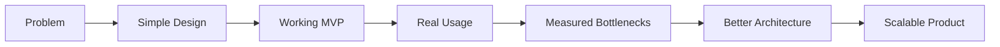

<!--
  AlphaDevs GitHub Organization Profile
  Location: .github/profile/README.md
-->

<h1 align="center">AlphaDevs</h1>

<p align="center">
  <strong>/helloworld</strong> — software engineering, AI workflows, cloud systems, automation, fintech, and Web3.
</p>

<p align="center">
  <a href="https://alphadevs.io">alphadevs.io</a>
  ·
  <a href="https://alphadevs.com">alphadevs.com</a>
  ·
  <a href="mailto:hello@alphadevs.io">hello@alphadevs.io</a>
</p>

<p align="center">
  
  
  
  
</p>

---

```bash
curl https://api.alphadevs.io/helloworld
```

```json
{
  "name": "AlphaDevs",
  "legalEntity": "Alpha Development Team (Pvt) Ltd",
  "type": "software_engineering_lab",
  "mode": "build_ship_iterate",
  "status": "online",
  "focus": [
    "AI-assisted engineering",
    "SaaS platforms",
    "cloud systems",
    "automation",
    "fintech workflows",
    "developer tools",
    "blockchain architecture"
  ],
  "principle": "Make the complex useful, the useful reliable, and the reliable scalable."
}
```

---

## `/helloworld`

We are **AlphaDevs** — the technology brand of **Alpha Development Team (Pvt) Ltd**.

We design and build practical software systems for real-world engineering and business problems. Our work lives across product engineering, cloud infrastructure, AI-assisted workflows, fintech systems, automation, developer tooling, and blockchain-enabled platforms.

We like software that feels simple on the outside, even when the engineering behind it is serious.

```ts
const alphaDevs = {
  brand: "AlphaDevs",
  legalEntity: "Alpha Development Team (Pvt) Ltd",
  mindset: "engineering-first",
  style: "clean, practical, scalable",
  defaultMode: "ship useful things",
  avoid: ["over-engineering", "mystery code", "manual repetition"],
  optimizeFor: ["clarity", "reliability", "speed", "security", "maintainability"]
};
```

---

## `/products`

We build systems, tools, and product foundations that help teams move faster without creating long-term technical debt.

| Endpoint | What we offer |
|---|---|
| `/products/saas` | SaaS platforms, MVPs, business applications, dashboards, admin portals, and product foundations. |
| `/products/cloud` | AWS-based deployments, containerized services, CI/CD, infrastructure automation, and production operations. |
| `/products/ai` | AI-assisted workflows, internal agents, knowledge search, automation copilots, and LLM-enabled business tools. |
| `/products/fintech` | Payment flows, reconciliation tools, trading system components, financial APIs, and operational dashboards. |
| `/products/integrations` | API integrations, middleware, data sync, event-driven services, and workflow automation. |
| `/products/web3` | Smart contracts, token workflows, custody models, blockchain listeners, and Web3 integration layers. |
| `/products/devtools` | Internal tools, templates, automation scripts, deployment helpers, and developer productivity systems. |

---

## `/engineering`

Our engineering culture is simple:

```text
Readable      > clever
Observable    > invisible
Automated     > repeated
Secure        > exposed
Useful        > impressive
Maintainable  > mysterious
```

We care about systems that developers can understand, operators can monitor, users can trust, and businesses can grow with.

```java
public final class EngineeringPrinciples {
    public static final String BUILD = "Start simple, design for growth";
    public static final String SHIP = "Deliver working software early";
    public static final String SCALE = "Improve with evidence, not assumptions";
    public static final String SECURE = "Treat security as architecture";
    public static final String MAINTAIN = "Code for the next engineer";
}
```

---

## `/ai`

AI is not just a feature box for us.

We explore AI as an engineering multiplier: helping teams search knowledge, automate workflows, generate insights, accelerate development, and connect fragmented business systems.

Things we like building around AI:

```text
AI agents for internal operations
Knowledge search over company data
LLM-assisted workflow automation
Engineering copilots
Document and data extraction
AI-enabled business dashboards
Multi-model orchestration
Human-in-the-loop automation
```

Our view:

> AI should reduce friction, not introduce magic that nobody can debug.

```python
def useful_ai(system):
    if not system.is_observable():
        return "too much magic"

    if not system.has_human_control():
        return "too much risk"

    if system.saves_time() and system.improves_quality():
        return "ship it"

    return "iterate"
```

---

## `/stack`

We are stack-flexible, but we prefer technology that is proven, maintainable, and production-friendly.

<p align="center">
  
  
  
  
  
  
  
  
  
  
  
  
</p>

```yaml
preferred_stack:
  backend:
    - Java
    - Spring Boot
    - Node.js
  frontend:
    - Angular
    - React
  cloud:
    - AWS
    - Docker
    - Kubernetes
    - CI/CD
  data:
    - MySQL
    - MariaDB
    - Kafka
    - Redis
  ai:
    - LLM workflows
    - agents
    - retrieval systems
    - automation pipelines
  blockchain:
    - Solidity
    - EVM chains
    - custody architecture
    - smart contract security
```

---

## `/architecture`

We like architecture that earns its complexity.



Our approach:

```text
Start simple.
Make it work.
Make it observable.
Make it secure.
Make it scalable when the system asks for it.
```

---

## `/lab`

Some ideas start as experiments.

Some experiments become tools.

Some tools become products.

This organization may include selected public work from our engineering lab:

```text
/experiments       early-stage ideas
/templates         reusable project foundations
/tools             automation and developer utilities
/reference         examples and implementation patterns
/research          technical explorations
/open-source       public projects we maintain
```

Not every repo here is a product.  
Not every product is public.  
But everything public here should say something about how we think.

---

## `/security`

We build with the assumption that systems will eventually meet the real world.

That means:

```text
Secrets should not leak.
Access should be intentional.
Logs should help, not expose.
Deployments should be repeatable.
Critical paths should be observable.
Failure modes should be understood.
```

For responsible security disclosures:

```text
security@alphadevs.io
```

---

## `/opensource`

Our public repositories are curated, not dumped.

We prefer fewer repositories that are useful, readable, and maintained over a large collection of abandoned experiments.

Public repositories may include:

```text
developer tools
starter templates
automation scripts
AI workflow examples
cloud deployment patterns
reference implementations
technical experiments
```

Some work remains private due to client, commercial, product, or security reasons.

---

## `/manifesto`

```text
We like clean APIs.
We like boring infrastructure that works.
We like automation that saves real time.
We like AI that makes teams sharper.
We like code that explains itself.
We like architecture that survives change.
We like products that ship.
```

```ts
type AlphaDevsManifesto = {
  build: "useful software";
  protect: "trust and security";
  automate: "repeated work";
  simplify: "complex workflows";
  scale: "when the system earns it";
  document: "so the next person wins";
};
```

---

## `/status`

```json
{
  "engineering": "active",
  "experiments": "running",
  "coffee": "required",
  "bugs": "tracked",
  "deployments": "intentional",
  "overEngineering": "rejected",
  "shipping": true
}
```

---

## `/contact`

```json
{
  "general": "hello@alphadevs.io",
  "github": "github@alphadevs.io",
  "security": "security@alphadevs.io",
  "web": [
    "https://alphadevs.io",
    "https://alphadevs.com"
  ]
}
```

---

<p align="center">
  <strong>AlphaDevs</strong>
  <br />
  Engineering practical software, intelligent systems, and modern digital products.
  <br />
  <br />
  <code>/build</code> · <code>/ship</code> · <code>/automate</code> · <code>/scale</code>
</p>
